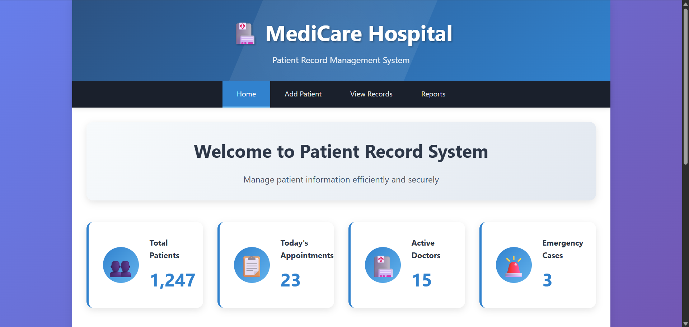

# 🏥 Hospital Patient Record System

A comprehensive web-based patient record management system built with Flask and SQLite. This system allows healthcare facilities to efficiently manage patient information, including personal details, medical history, and emergency contacts.

---

## 📸 Screenshots


---

## ✨ Features

- **Patient Registration**: Complete patient intake form with validation
- **Patient Records Management**: View, search, and filter patient records
- **Responsive Design**: Works seamlessly on desktop and mobile devices
- **Data Validation**: Comprehensive form validation and error handling
- **Search & Filter**: Search by name, phone, or patient ID with gender and blood type filters
- **Emergency Contacts**: Store emergency contact information for each patient
- **Medical Information**: Track allergies, medications, and medical history
- **Secure Database**: SQLite database with proper data integrity

## 🚀 Getting Started

### Prerequisites

- Python 3.7 or higher
- Flask framework
- SQLite (included with Python)

### Installation

1. **Clone the repository**
   ```bash
   git clone https://github.com/yourusername/hospital-patient-record-system.git
   cd hospital-patient-record-system
   ```

2. **Create a virtual environment (recommended)**
   ```bash
   python -m venv venv
   
   # On Windows
   venv\Scripts\activate
   
   # On macOS/Linux
   source venv/bin/activate
   ```

3. **Install dependencies**
   ```bash
   pip install flask
   ```

4. **Run the application**
   ```bash
   python app.py
   ```

5. **Access the application**
   Open your browser and navigate to `http://localhost:5000`

## 📁 Project Structure

```
hospital-patient-record-system/
│
├── app.py                 # Main Flask application
├── hospital.db           # SQLite database (created automatically)
├── templates/
│   ├── patient_form.html  # Patient registration form
│   ├── patients.html      # Patient records view
│   └── home.html         # Dashboard (you'll need to create this)
├── static/
│   └── styles.css        # CSS styles (you'll need to create this)
└── README.md             # This file
```

## 🗄️ Database Schema

The system uses SQLite with the following patient table structure:

```sql
CREATE TABLE patients (
    patient_id INTEGER PRIMARY KEY,
    first_name TEXT NOT NULL,
    last_name TEXT NOT NULL,
    date_of_birth DATE NOT NULL,
    gender TEXT NOT NULL,
    blood_type TEXT,
    marital_status TEXT,
    phone TEXT NOT NULL,
    email TEXT,
    address TEXT NOT NULL,
    city TEXT NOT NULL,
    state TEXT NOT NULL,
    zip_code TEXT NOT NULL,
    emergency_name TEXT NOT NULL,
    emergency_relation TEXT NOT NULL,
    emergency_phone TEXT NOT NULL,
    primary_doctor TEXT,
    insurance_provider TEXT,
    policy_number TEXT,
    allergies TEXT,
    medications TEXT,
    medical_history TEXT,
    created_at TIMESTAMP DEFAULT CURRENT_TIMESTAMP
);
```

## 🎯 Usage

### Adding a New Patient

1. Navigate to the "Add Patient" page
2. Fill in all required fields (marked with *)
3. Enter a unique Patient ID
4. Complete personal, contact, emergency, and medical information
5. Click "Add Patient" to save the record

### Viewing Patient Records

1. Go to "View Records" page
2. Use the search bar to find specific patients
3. Filter by gender or blood type using dropdown menus
4. View comprehensive patient information in the table

### Required Fields

- Patient ID (must be unique)
- First Name & Last Name
- Date of Birth
- Gender
- Phone Number
- Complete Address (Address, City, State, ZIP Code)
- Emergency Contact Information (Name, Relationship, Phone)

## 🛠️ API Endpoints

| Method | Endpoint | Description |
|--------|----------|-------------|
| GET | `/` | Dashboard home page |
| GET/POST | `/patient_form` | Patient registration form |
| GET | `/patients` | View all patient records |

## 🔧 Configuration

### Environment Setup

Create a `.env` file in the root directory for production settings:

```env
SECRET_KEY=your-super-secret-key-here
DEBUG=False
DATABASE_PATH=hospital.db
```

### Security Considerations

- Change the default `secret_key` in production
- Set `DEBUG=False` in production environment
- Consider using environment variables for sensitive configuration
- Implement user authentication for production use

## 🚦 Development

### Running in Development Mode

The application runs in debug mode by default:

```python
app.run(debug=True, host='0.0.0.0', port=5000)
```

### Database Management

The database is automatically initialized when you first run the application. To reset the database:

1. Stop the application
2. Delete `hospital.db` file
3. Restart the application

## 📋 Features Roadmap

- [ ] User authentication and role-based access
- [ ] Patient appointment scheduling
- [ ] Medical report generation
- [ ] Data export functionality (PDF, CSV)
- [ ] Advanced search with date ranges
- [ ] Patient visit history tracking
- [ ] Integration with medical devices
- [ ] Backup and restore functionality

## 🤝 Contributing

1. Fork the repository
2. Create a feature branch (`git checkout -b feature/AmazingFeature`)
3. Commit your changes (`git commit -m 'Add some AmazingFeature'`)
4. Push to the branch (`git push origin feature/AmazingFeature`)
5. Open a Pull Request

## 📄 License

This project is licensed under the MIT License - see the [LICENSE](LICENSE) file for details.

## 🆘 Troubleshooting

### Common Issues

**Database Error: Patient ID already exists**
- Each patient must have a unique Patient ID
- Check existing records before adding new patients

**Form Validation Errors**
- Ensure all required fields (marked with *) are filled
- Check date format for Date of Birth field
- Verify phone numbers are in correct format

**Application Won't Start**
- Check Python version (3.7+ required)
- Verify Flask is installed: `pip show flask`
- Ensure no other application is using port 5000

### Database Issues

To view/edit the database directly, you can use SQLite browser tools:
- [DB Browser for SQLite](https://sqlitebrowser.org/)
- Command line: `sqlite3 hospital.db`

## 👥 Support

For support and questions:
- Open an issue on GitHub
- Check the documentation
- Review common troubleshooting steps above

## 🏗️ Built With

- **Flask** - Web framework
- **SQLite** - Database
- **HTML5/CSS3** - Frontend
- **JavaScript** - Client-side functionality

---

**Made with ❤️ for healthcare professionals**

*This system is designed to help healthcare facilities manage patient records efficiently and securely.*
